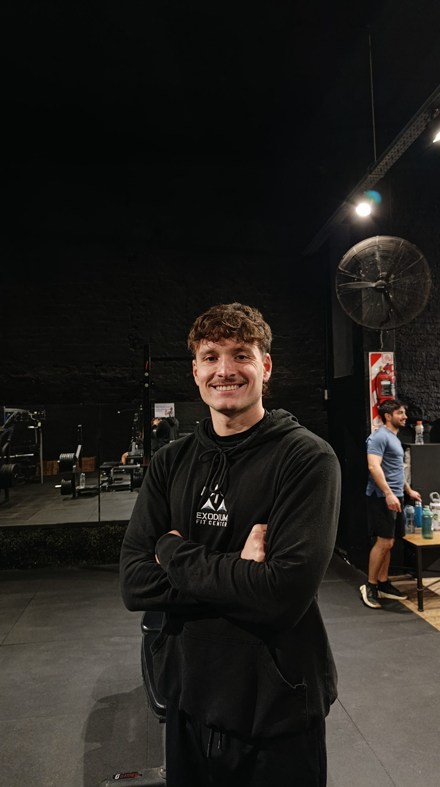

# MAX Training — Landing de entrenador personal

Página web de una sola pantalla para un entrenador personal, en español y con tema oscuro.
HTML, CSS y JavaScript sin dependencias ni proceso de compilación.

## Ver la página

- **En producción:** https://awdawawdadwawd.github.io/max-training/
- **En local:** abre `index.html` en el navegador. No hace falta servidor.

## Estructura

```
index.html    Estructura y contenido
styles.css    Estilos (paleta y medidas en :root)
script.js     Menú móvil, animaciones, contadores y validación del formulario
img/          Imágenes del sitio
```

## Secciones

Hero · Marquesina · Sobre mí · Tu objetivo · Visión · El proceso · Servicios ·
Opiniones · CTA · Blog · Preguntas frecuentes · Contacto · Footer

## Imágenes pendientes

Los huecos de imagen se ven como un recuadro punteado con el texto «Insertar imagen».
Cada uno está marcado con un atributo `data-slot`:

| `data-slot`              | Dónde va                    | Proporción |
| ------------------------ | --------------------------- | ---------- |
| `hero`                   | Foto principal              | vertical   |
| `sobre-mi`               | Retrato de la sección Sobre mí | 4:5     |
| `vision`                 | Sección Visión              | 4:3        |
| `post-1`, `post-2`, `post-3` | Portadas del blog       | 16:10      |
| `avatar-1`, `avatar-2`, `avatar-3` | Fotos de las reseñas | 1:1     |

Para colocar una imagen real, sustituye el contenido del recuadro por una etiqueta `img`
(el CSS ya la recorta a la medida correcta):

```html
<div class="img-slot img-slot--hero" data-slot="hero">
  
</div>
```

## Personalizar

- **Colores:** todas las variables están al principio de `styles.css`, en `:root`.
  Cambiando `--verde`, `--verde-claro`, `--verde-tinte` y `--verde-hondo` cambia el acento
  de toda la web.
- **Nombre y datos de contacto:** email, teléfono y dirección son de ejemplo. Aparecen en la
  sección de contacto y en el footer.
- **Formulario:** valida en el navegador pero todavía no envía nada. Hay un `TODO` en
  `script.js` donde conectar Formspree, EmailJS o un backend propio.
- **WhatsApp:** los cuatro botones de la sección Servicios apuntan al número de ejemplo
  `5491100000000`. Reemplazalo por el número real (código de país + área, sin `+` ni espacios)
  en las cuatro URLs `wa.me` de `index.html`. Cada botón lleva un mensaje distinto ya escrito,
  así sabés desde qué plan te escriben.

## Accesibilidad

Navegación por teclado con foco visible, etiquetas ARIA en el menú y respeto por
`prefers-reduced-motion`.
